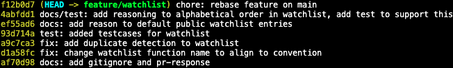

# PR Response Doc — CineLog Watchlist Feature

## AI Usage

I asked Claude to read `pr-response.md`, `watchlist_service.py`, and
`test_watchlist.py` and review the git commit history, then I asked it describe
the PR to me such as the added features and design decisions. Using this
information, I asked Claude to write the PR description.

Claude generated manual testing steps by running the app and creating users and
films through API endpoints, but there are no API endpoints to do that. So I
rewrote the testing steps section to use only the pytest file for testing.

## Comment 1 — Rename

**What I did:** in `watchlist_service.py`, I found `save_to_watchlist` and right
click → "Go to References" to find all references, and I renamed the function
name and all its references to `add_to_watchlist`.

**How I verified:** a project-wide search of `save_to_watchlist` returns no
result.

## Comment 2 — Deduplication

**What I did:** in `collection_service.py`, I found the logic that handled
duplication and copied that block of code along with the Exception it raised to
`add_to_watchlist` in `watchlist_service.py`, then I rewrote the names and
strings so they describe watchlists instead of collections.

**How I verified:** a search of "collection" in `watchlist_service.py` returns
no results that needed to be renamed. the model for `WatchlistEntry` has the
same `user_id` and `film_id` fields as `CollectionEntry`, so the arguments
passed into `filter_by` can remain the same. functionality check is implemented
in the next commit.

## Comment 3 — Missing test

**What I did:** I copied all tests from `test_collection.py` to
`test_watchlist.py` and rewrote all the collection references to watchlist.

**How I verified:** all testcases for both collection and watchlist passes,
except the one that tests watchlist order, which will be handled in a later fix.

## Comment 4 — Default visibility

**My position:** `public=True` is an intentional choice that aligns with the
purpose of the program.

**Reasoning:** `public=True` default allows the user and anyone who wants to
learn more about the user a chance to view their watchlist. this system is
designed to be a community, and defaulting to public is important to facilitate
conversation.

**Tradeoff acknowledged:** some users might want some or all entries on their
watchlist be private, and that requires an extra step.

## Comment 5 — Sort order

**My position:** alphabetical order is easier to find a specific entry

**Reasoning:** as the list of entries grows, it will quickly become unmanagable
to skim through the list and quickly find an entry. alphabetical order makes
searching an entry for a specific movie easier, as not everyone remember when
they watched it.

**Engagement with reviewer's point:** ordering by recency is easier when looking
for a recently watched movie, which might be useful in some cases, but
alphabetical order is a more convenient choice for users in the long run.

## Comment 6 — Rebase

**What conflicted:**

-   the .gitignore in the main branch conflicted with the newly added one in
    feature branch from milestone 1
-   `WatchlistEntry` in `models.py` was removed after rebase

**How I resolved it:**

-   I chose the .gitignore from the main branch as it also ignored
    `.pytest_cache/`
-   added `WatchlistEntry` back

**How I verified no conflict remains:** no conflict markers remain, and all
testcases pass

## git log

## PR Description

### Feature overview

This PR adds a **watchlist** feature to CineLog, letting a user save films they
want to watch later, separate from their existing "collection" of films
they've already watched. It adds:

-   a `WatchlistEntry` model (`user_id`, `film_id`, `date_added`, `public`)
-   `add_to_watchlist(user_id, film_id)` in `watchlist_service.py`, which
    creates an entry, rejects films that don't exist (`FilmNotFoundError`),
    and rejects duplicate entries (`AlreadyInWatchlistError`)
-   `get_watchlist(user_id)` in `watchlist_service.py`, which returns a
    user's watchlist films sorted alphabetically by title
-   two endpoints in `routes/watchlist/watchlist.py`:
    -   `POST /watchlist/<user_id>/add` — body `{ "film_id": <str> }`, adds a
        film to the user's watchlist
    -   `GET /watchlist/<user_id>` — returns the user's watchlist

### Design decisions

-   **Default visibility (`public=True`)** — new watchlist entries default
    to public. CineLog is built around a community of users, and a public
    default lets other users discover what someone is planning to watch
    without an extra step. The tradeoff is that users who want a private
    watchlist have to opt out entry-by-entry. See
    [Comment 4 — Default visibility](#comment-4--default-visibility) for the
    full reasoning.
-   **Sort order (alphabetical by title)** — `get_watchlist` orders entries
    alphabetically rather than by recency. As a watchlist grows, alphabetical
    order makes it much easier to scan for a specific title, since users
    don't reliably remember when they added something. See
    [Comment 5 — Sort order](#comment-5--sort-order) for the full reasoning
    and the recency-order tradeoff.

### Manual testing steps

Run the automated suite to confirm everything is covered:
`pytest tests/test_watchlist.py -v`.

-   `test_add_to_watchlist_creates_entry` tests creating a watchlist entry for
    a sample user and a sample movie.
-   `test_add_to_watchlist_duplicate_raises` tests raising
    `AlreadyInWatchlistError` when the sample user attempts to add the same
    movie into their watchlist more than once.
-   `test_add_to_watchlist_nonexistent_film_raises` tests raising
    `FilmNotFoundError` when the sample user attempts to add a non-existent
    movie into their watchlist.
-   `test_get_watchlist_returns_alphabetical` tests getting the sample user's
    watchlist and check if the watchlist lists out movies in alphabetical order
    when there are more than 1 movie in the watchlist.